# ARCHITECTURE.md

## Full-Stack Monitoring Architecture

Comprehensive reference architecture for enterprise-grade monitoring infrastructure using Prometheus, Grafana, and 20+ specialized exporters.

## System Components

### Core Stack

1. **Prometheus** (9090)
   - Time-series database for metrics collection
   - Multi-DC scraping capability
   - Built-in alerting rules engine
   - 15-day data retention (configurable)

2. **Grafana** (3000)
   - Metrics visualization and dashboarding
   - Multi-datasource support
   - Native alert rules and routing
   - Multi-channel notifications (Email, Webhook, Slack, Teams, etc.)
   - User authentication and RBAC

## Data Flow

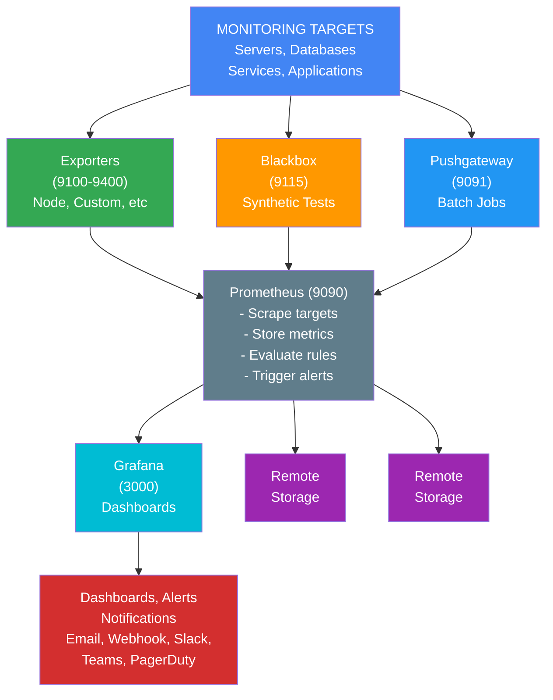


    RSTOR["Remote Storage"]
    NOTIF["Dashboards, Alerts &<br/>Notifications<br/>(Email, Webhook,<br/>Slack, Teams, PagerDuty)"]
    
    EXP --> PROM
    BX --> PROM
    PG --> PROM
    PROM --> GRAF
    PROM --> RSTOR
    GRAF --> NOTIF
    
    style PROM fill:#f9f,stroke:#333,stroke-width:2px
    style GRAF fill:#bbf,stroke:#333,stroke-width:2px
```

## Monitoring Layers

### Layer 1: Infrastructure Monitoring

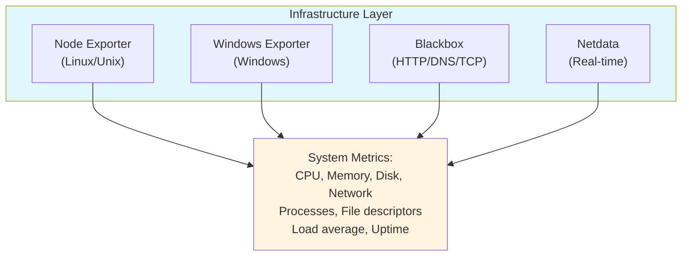

### Layer 2: Data & Storage Layer

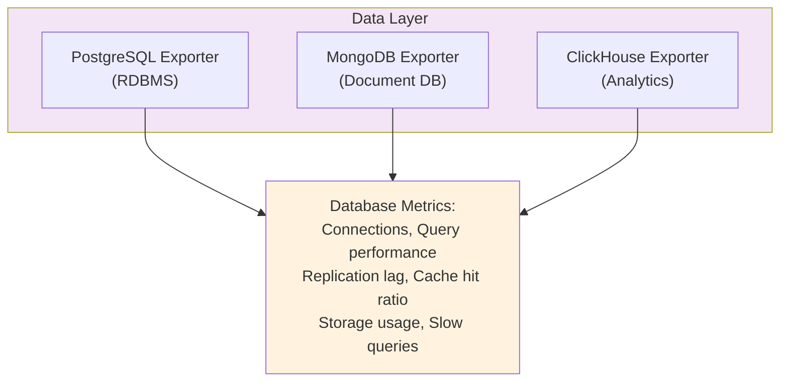

### Layer 3: Message & Event Layer

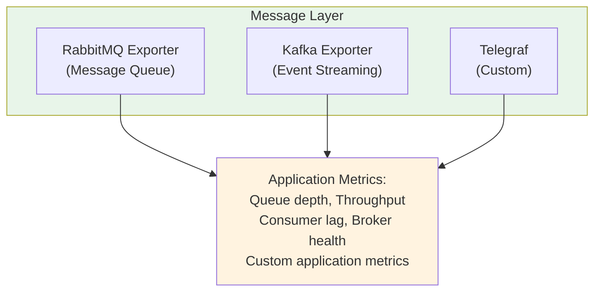

### Layer 4: Network & Services Layer

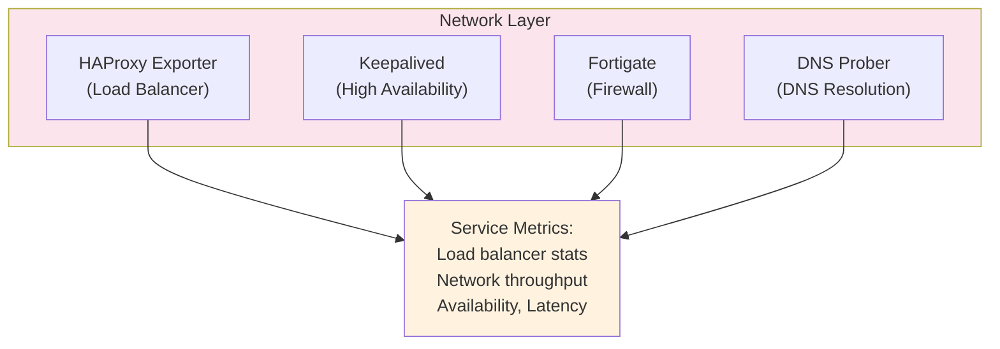

### Layer 5: Specialized Monitoring

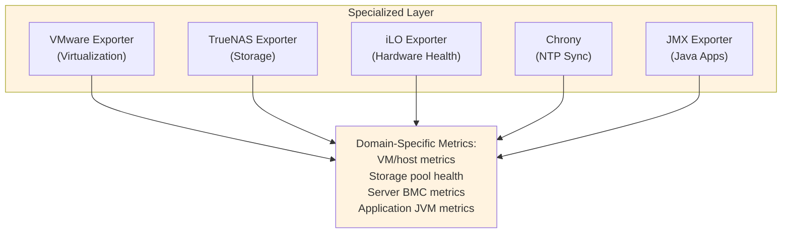

## Metric Collection Strategy

### Pull Model (Prometheus Native)


### Push Model (Pushgateway)

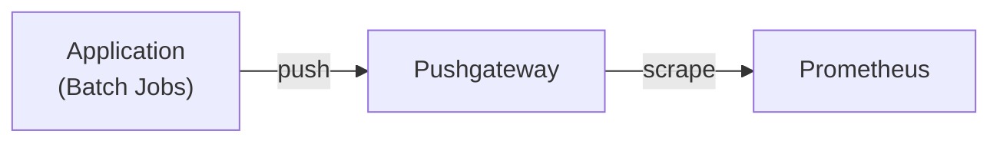

### Federation

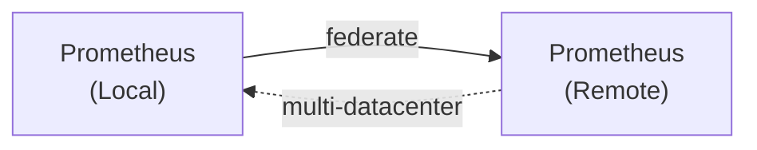

## High Availability Architecture

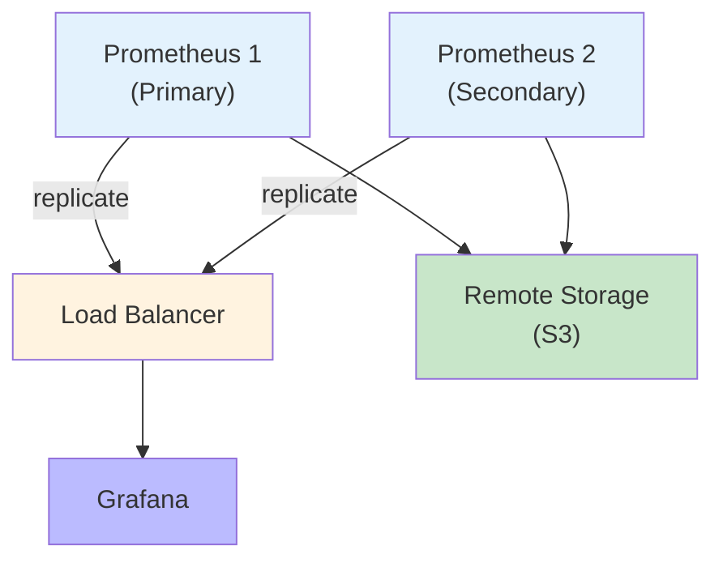

## Alert Flow
```

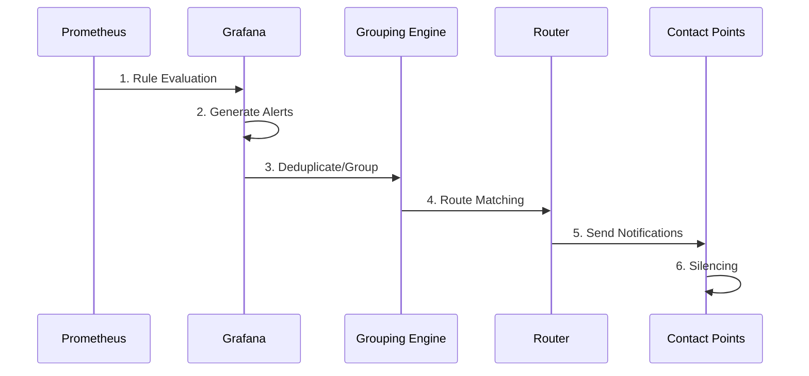

## Metric Retention Policies

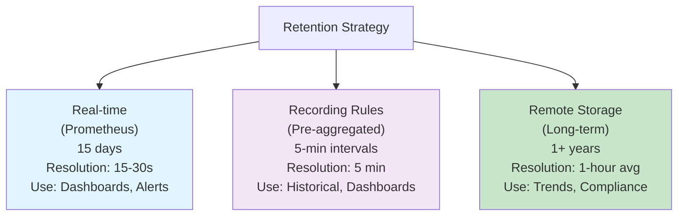

## Scalability Considerations

### Horizontal Scaling

**Add Prometheus Instances**:
- Use metric relabeling to shard targets
- Load balance via Nginx/HAProxy
- Separate scrapers for different target groups

**Add Grafana Instances**:
- Use external database (MySQL/PostgreSQL)
- Multiple Grafana servers behind load balancer
- Session store in database
- Centralized alerting configuration

### Vertical Scaling

**Prometheus Memory**:
- ~1GB per million metrics/day
- Adjust based on scrape frequency
- Monitor via `prometheus_tsdb_symbol_table_size_bytes`

**Storage Requirements**:
- Adjust retention: `--storage.tsdb.retention.time`
- Use compression: `--storage.tsdb.max-block-chunks`

## Security Architecture

### Network Security

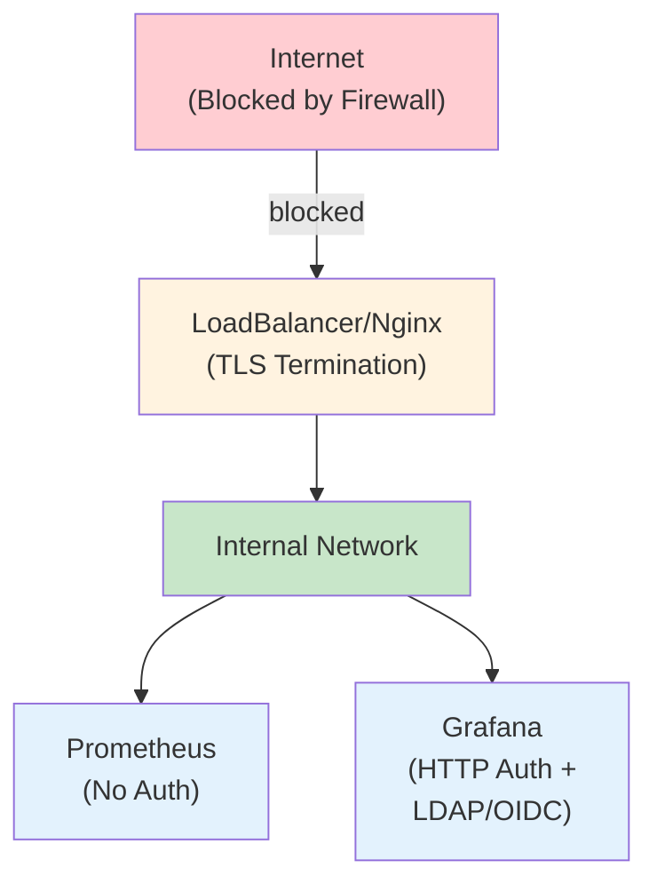

### Data Security
- Encrypt secrets in transit (TLS)
- Store credentials in secure storage (Vault)
- Audit access logs
- Regular backups with encryption

### Access Control
- Prometheus: Enforce via reverse proxy
- Grafana: RBAC with organizations and teams
- AlertManager: Protected endpoint configuration

## Integration Points

### Observability Stack
- Prometheus → Jaeger/Zipkin (traces)
- Logs → ELK/Loki (centralized logging)
- Metrics → Prometheus (monitoring)
- Events → AlertManager (alerting)

### External Systems
- OIDC/OAuth for authentication
- LDAP for user directory
- Slack/Teams for notifications
- PagerDuty for on-call routing
- SMTP for email alerts

## Disaster Recovery

### Backup Strategy
```
Daily Backups
├─ Prometheus data (tar.gz)
├─ Grafana datasources, dashboards & alerts
├─ Exporter configurations
└─ Docker volumes
    ↓
    Stored in S3/Off-site
```

### Recovery Time Objectives
- RTO: < 1 hour (restore from backup)
- RPO: < 1 day (daily backups)
- Verify: Weekly backup restoration tests

## Operational Procedures

### Deployment
1. Update configurations (Git)
2. Validate syntax
3. Dry-run in staging
4. Rolling update to production
5. Health checks

### Maintenance
- Monthly: Review alert rules
- Quarterly: Update exporters
- Annually: Capacity planning review
- As-needed: Configuration updates

### Monitoring the Monitors
```
Grafana Health
├─ Alert rule evaluation
├─ Notification delivery
├─ Dashboard render time
├─ Datasource connectivity
└─ User sessions

Prometheus Health
├─ Scrape success rate
├─ Ingestion rate
├─ Storage utilization
└─ Query latency
```

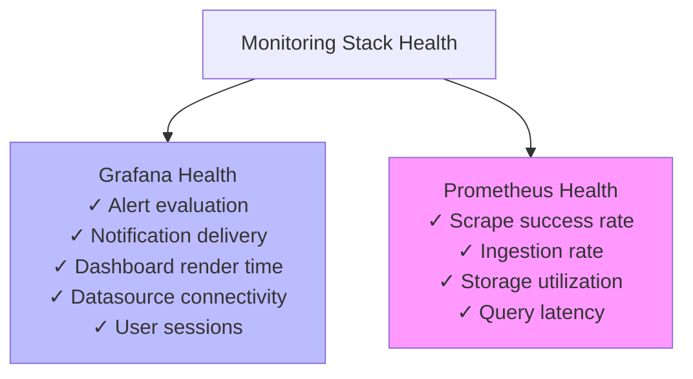

## Best Practices Summary

1. **Metrics**: Use consistent naming, appropriate cardinality
2. **Retention**: Right-size data retention policy
3. **Performance**: Use recording rules, optimize queries
4. **Reliability**: Implement HA, regular backups
5. **Security**: TLS, RBAC, secret management
6. **Operations**: IaC, documentation, runbooks
7. **Alerting**: Meaningful thresholds, routing hierarchy
8. **Scalability**: Federation, storage optimization, sharding

---

**For detailed setup instructions, see deployment guides in `deployment/` directory**
