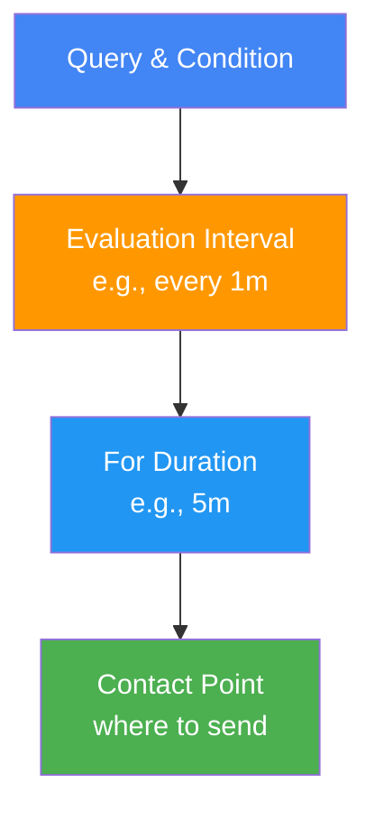
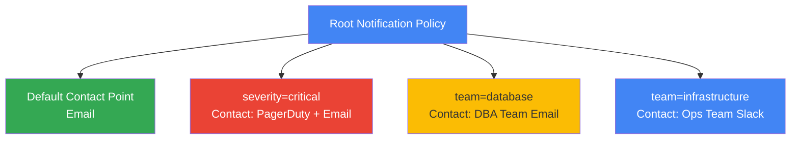

# Grafana Alerting Guide

Complete guide to setting up native Grafana alerts with notifications.

## 🎯 Overview

This project uses **Grafana's native alerting system** instead of Prometheus AlertManager. Grafana alerts offer:

✅ Built-in to Grafana (no separate service needed)  
✅ Direct integration with dashboards and panels  
✅ Multiple notification channels (email, webhooks, Slack, Teams, PagerDuty, etc.)  
✅ Advanced routing and grouping  
✅ Rich alert history and previews  
✅ Alert state tracking and annotations  

---

## 🚀 Quick Start

### 1. Access Alerting UI

In Grafana:
1. Left sidebar → **Alerts** (bell icon)
2. Click **Alert rules** tab
3. Click **+ New alert rule** button

### 2. Create Your First Alert

**Example: CPU Usage Alert**

1. **Set query**
   - Name: `CPU Usage`
   - Data source: Prometheus
   - Query: `100 - (avg by (instance) (rate(node_cpu_seconds_total{mode="idle"}[5m])) * 100)`

2. **Set condition**
   - `CPU Usage > 80` (warn)
   - `CPU Usage > 90` (critical)

3. **Set notification channel**
   - Under "Contact point", select or create a contact point
   - Choose notification method (email, webhook, etc.)

4. **Name and save**
   - Rule name: `High CPU Usage`
   - Save alert rule

---

## 📧 Contact Points (Notification Channels)

Contact points define where alerts are sent.

### 1. Email Notifications

**Setup**:
1. Navigate to **Alerting** → **Contact points**
2. Click **+ New contact point**
3. Enter name: `Email`
4. Type: **Email**
5. Configure SMTP settings
6. Add recipient email addresses
7. Save

**SMTP Configuration** (if not pre-configured):
```
SMTP Server: smtp.gmail.com
Port: 587
From Address: your-email@gmail.com
Password: your-app-password
```

### 2. Webhook Notifications

**Setup**:
1. Create new contact point
2. Type: **Webhook**
3. URL: `http://your-webhook-endpoint.com/alerts`
4. Save

**Webhook Payload**:
```json
{
  "alerts": [
    {
      "status": "firing",
      "labels": {
        "alertname": "HighCPU",
        "instance": "server1:9100"
      },
      "values": {
        "A": 85.5
      }
    }
  ]
}
```

### 3. Slack Integration

**Setup**:
1. Create Slack webhook: https://api.slack.com/messaging/webhooks
2. In Grafana, create new contact point
3. Type: **Slack**
4. Paste webhook URL
5. Configure channel, username, etc.
6. Save

---

## 🎯 Alert Rule Configuration

### Basic Structure



### Evaluation

- **Evaluation interval**: How often to check condition (default 1m)
- **For duration**: How long condition must be true to trigger (default 5m)
  - Prevents false alarms from temporary spikes
  - Set to 0 to alert immediately

### States

- **Normal**: Condition false
- **Pending**: Condition true, waiting for "for" duration
- **Alert**: Condition true + "for" duration passed = alert firing
- **No data**: Query returns no data (can configure behavior)

---

## 📊 Example Alert Rules

### Infrastructure Alerts

#### CPU Usage Alert
```
Query: 100 - (avg by (instance) (rate(node_cpu_seconds_total{mode="idle"}[5m])) * 100)
Condition: A > 80
For: 5m
```

#### Memory Usage Alert
```
Query: 100 * (1 - ((node_memory_MemAvailable_bytes / node_memory_MemTotal_bytes)))
Condition: A > 85
For: 5m
```

#### Disk Space Alert
```
Query: 100 * (node_filesystem_avail_bytes / node_filesystem_size_bytes)
Condition: A < 15
For: 10m
```

### Database Alerts

#### PostgreSQL Replication Lag
```
Query: pg_replication_lag
Condition: A > 1000000000  # > 1GB
For: 5m
Contact: Critical alert
```

#### PostgreSQL Connection Pool
```
Query: pg_stat_activity_count{state="active"}
Condition: A > 80
For: 5m
```

### Endpoint Alerts

#### Service Unavailable
```
Query: probe_success
Condition: A < 1
For: 2m
Contact: High priority
```

#### SSL Certificate Expiry
```
Query: (probe_ssl_earliest_cert_expiry - time()) / 86400
Condition: A < 7  # Less than 7 days
For: 0m  # Alert immediately
```

### Message Queue Alerts

#### High Queue Depth
```
Query: rabbitmq_queue_messages_ready
Condition: A > 10000
For: 10m
```

#### Consumer Lag
```
Query: kafka_consumer_lag_sum
Condition: A > 500000
For: 10m
```

---

## 🔔 Alert Routing

Alert routing determines which contact points receive which alerts.

### Setup Routing

1. Navigate to **Alerting** → **Notification policies**
2. Configure routing tree:



### Grouping

Control how alerts are grouped in notifications:

```yaml
group_by: ['alertname', 'instance', 'severity']
group_interval: 5m  # How often to send grouped alerts
repeat_interval: 4h # How often to repeat ongoing alerts
```

---

## 🎛️ Advanced Features

### Alert Annotations

Add context to alerts:

```
summary: High CPU usage on {{$labels.instance}}
description: CPU usage is {{ humanize $value }}% 
runbook: https://wiki.example.com/high-cpu
```

### Multi-Condition Alerts

Combine multiple queries:

```
Query A: CPU > 80
Query B: Memory > 85

Condition: (A OR B)  # Alert if either condition true
```

### Alert Silencing

Temporarily silence alerts:

1. Navigate to **Alerting** → **Silences**
2. Click **+ New silence**
3. Select alert labels to silence
4. Set duration
5. Add comment

**Use cases**:
- Maintenance windows
- During deployments
- Temporary issues being investigated

### Alert History

View alert state transitions:

1. Navigate to **Alerting** → **Alert instances**
2. Filter by alert name or label
3. View firing/pending/resolved history
4. See notifications sent

---

## 🔧 Dashboard Integration

### Add Alert to Dashboard Panel

1. Edit dashboard panel
2. Scroll to **Alert** section
3. Click **Create alert**
4. Configure threshold conditions
5. Choose contact point
6. Save

**Panel-level alerts** show as red/yellow borders when triggered.

### Viewing Alert State in Dashboards

Panels with alerts show:
- Green border: Normal
- Yellow border: Alert pending
- Red border: Alert firing

---

## 📝 Best Practices

### Alert Rule Design

✅ **Do**:
- Use descriptive names: `High Database Replication Lag`
- Include runbook links in descriptions
- Set appropriate "for" durations (5-15 min for most)
- Use labels for routing (severity, team, component)
- Test queries first in Prometheus/Grafana

❌ **Don't**:
- Create alerts for every possible metric
- Set very short "for" durations (causes noise)
- Alert on symptoms, not root causes
- Ignore alert storm or cascading alerts

### Notification Channels

✅ **Do**:
- Use severity-based routing (critical → PagerDuty, warning → Slack)
- Include context in notifications (runbook, dashboard links)
- Test contact points before production use
- Monitor notification delivery

❌ **Don't**:
- Send all alerts to same channel (creates noise)
- Use SMS for non-critical alerts (expensive)
- Forget to update contact info when teams change
- Leave default Grafana channel as fallback

### Incident Response

✅ **Do**:
- Include resolved notifications
- Add annotations with investigation steps
- Link to dashboards for quick access
- Document runbook procedures

❌ **Don't**:
- Ignore resolved notifications
- Create ambiguous alert names
- Leave alerts in "pending" forever
- Skip post-incident reviews

---

## 🚨 Troubleshooting

### Alerts Not Firing

**Check**:
1. Prometheus data: Verify query returns values in Prometheus UI
2. Condition logic: Ensure condition is met (test with simple threshold)
3. "For" duration: Alert may be pending, not yet firing
4. Evaluation interval: Check if sufficient time has passed

**Debug**:
```promql
# In Prometheus, verify metric exists
100 - (avg by (instance) (rate(node_cpu_seconds_total{mode="idle"}[5m])) * 100)
```

### Notifications Not Sending

**Check**:
1. Contact point: Verify configuration in Contact Points
2. Test notification: Click "Send test notification"
3. Email: Check spam folder
4. Webhook: Monitor webhook endpoint logs
5. Grafana logs: `docker logs grafana`

**Test Email**:
1. Navigate to Contact Points
2. Click contact point
3. Click "Test" button
4. Check email inbox/spam

### Alert State Issues

- **Stuck in Pending**: Increase "for" duration or lower threshold
- **Too Many Alerts**: Add grouping or silencing
- **Noisy Alerts**: Increase "for" duration to 15+ minutes
- **Missing Alerts**: Check data source connectivity

---

## 📚 Related Documentation

- [GRAFANA_DASHBOARDS.md](GRAFANA_DASHBOARDS.md) - Dashboard setup
- [MONITORING_MATRIX.md](MONITORING_MATRIX.md) - Metrics reference
- [metric_queries.md](../examples/metric_queries.md) - PromQL examples
- [TROUBLESHOOTING.md](TROUBLESHOOTING.md) - General troubleshooting

---

## 🔗 Resources

- [Grafana Alerting Docs](https://grafana.com/docs/grafana/latest/alerting/)
- [Grafana Alert Rules](https://grafana.com/docs/grafana/latest/alerting/manage-alarms/)
- [Contact Points](https://grafana.com/docs/grafana/latest/alerting/manage-notifications/)
