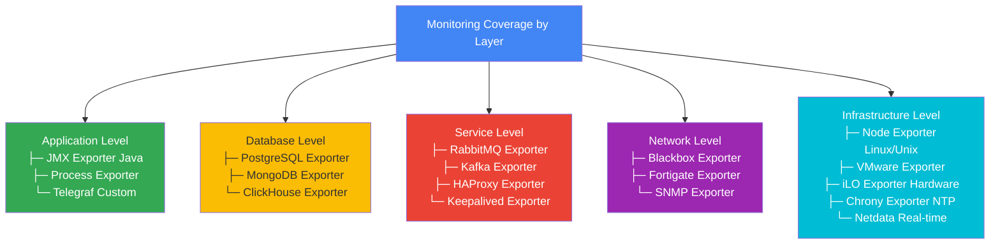

# Monitoring Matrix

Comprehensive overview of all monitoring components and their capabilities included in this full-stack monitoring solution.

## Infrastructure Monitoring

### Node Exporter

| Metric Category | Component | Key Metrics | Cardinality | Impact |
|-----------------|-----------|------------|-------------|--------|
| **CPU** | Processor | cpu_seconds, context_switches, load average | Low | Real-time performance |
| **Memory** | RAM | memory_bytes, swap_usage, page_faults | Low | Capacity planning |
| **Disk** | Block Storage | filesystem_usage, disk_io | Medium | Storage alerts |
| **Network** | NICs | network_traffic, errors, dropped packets | Medium | Connectivity |
| **System** | OS | uptime, processes, file descriptors | Low | System health |

**Use Cases**: Base infrastructure monitoring, SLA tracking, capacity planning

---

### Blackbox Exporter

| Probe Type | Component | Key Metrics | Coverage | SLA Impact |
|-----------|-----------|------------|----------|-----------|
| **HTTP/HTTPS** | Web services | status_code, latency, SSL expiry | External | Critical |
| **DNS** | Name resolution | lookup_time, record_count | Critical | High |
| **TCP** | Service ports | connection_time, TLS handshake | Critical | High |
| **ICMP** | Network | latency, packet_loss | Network | Medium |

**Use Cases**: Endpoint monitoring, SSL expiration tracking, synthetic monitoring, multi-region checks

---

## Database Monitoring

### PostgreSQL Exporter

| Metric Category | Component | Key Metrics | Alertable | Documentation |
|-----------------|-----------|------------|-----------|---|
| **Connections** | Connection Pool | active, idle, state counts | Yes | [View](../exporters/postgres_exporter.md) |
| **Performance** | Query Engine | TPS, cache hit ratio, slow queries | Yes | [View](../exporters/postgres_exporter.md) |
| **Replication** | WAL/Standby | lag, slot status, replica health | Yes | [View](../exporters/postgres_exporter.md) |
| **Storage** | Disk Usage | database/table/index size | Yes | [View](../exporters/postgres_exporter.md) |
| **Indexes** | Index Management | bloat, unused, missing indexes | Yes | [View](../exporters/postgres_exporter.md) |

**Metrics**: 100+ database metrics  
**Setup**: Moderate · **Criticality**: High  
**Primary Use**: Production database monitoring

---

### MongoDB Exporter

| Metric Category | Component | Metrics Exposed | Alert Conditions |
|-----------------|-----------|-----------------|------------------|
| **Replica Set** | Replication | oplog_lag, member_health, elections | Lag > 10s, member down |
| **Operations** | Query Engine | operations/sec, slow_queries | High slow query rate |
| **Memory** | Heap | memory_usage, cache_usage | > 85% usage |
| **Storage** | Data Files | collection_size, index_size | Disk space < 10% |

**Metrics**: 150+ MongoDB metrics  
**Setup**: Moderate · **Criticality**: High  
**Primary Use**: Document database monitoring

---

### ClickHouse Exporter

| Monitoring Area | Metrics | Frequency | Alert Triggers |
|-----------------|---------|-----------|-----------------|
| **Cluster** | Replica count, leader status | 15s | Replica down |
| **Performance** | Query latency, throughput | 15s | Latency spike |
| **Storage** | Disk usage, compression ratio | 60s | Space critical |

**Metrics**: 80+ ClickHouse metrics  
**Setup**: Simple · **Criticality**: Medium  
**Primary Use**: Analytics database monitoring

---

## Message Queue & Event Streaming

### RabbitMQ Exporter

| Component | Metrics | Threshold | Action |
|-----------|---------|-----------|--------|
| **Queues** | depth, ingestion_rate, ack_rate | depth > 10k | Investigate backing consumers |
| **Connections** | count, channels, consumers | >1000 | Scale consumers |
| **Memory** | usage_bytes, heap_size | >85% | Scale nodes |
| **Disk** | usage, threshold_alarm | alarm_set | Increase disk |

**Metrics**: 200+ RabbitMQ metrics  
**Setup**: Moderate · **Criticality**: High  
**Primary Use**: Message broker monitoring, queue health

---

### Kafka Exporter

| Monitoring Level | Metrics | Coverage | Alerting |
|-----------------|---------|----------|----------|
| **Broker** | leader_count, replica_count | Per-broker | Broker down |
| **Topic** | partition_count, replication_factor | Per-topic | Under-replicated |
| **Consumer** | lag, committed_offset | Per-group | Lag threshold |
| **Disk** | log_size, retention_time | Per-broker | Disk space |

**Metrics**: 100+ Kafka metrics  
**Setup**: Complex · **Criticality**: High  
**Primary Use**: Event streaming monitoring, consumer lag tracking

---

### Telegraf

| Plugin Type | Metrics | Flexibility | Customization |
|------------|---------|--------------|---|
| **Input** | System, HTTP, SQL, more | High | Unlimited |
| **Processing** | Aggregation, regex, math | High | Custom |
| **Output** | Prometheus, HTTP, etc | High | Plugin-based |

**Metrics**: Unlimited custom metrics  
**Setup**: Moderate · **Criticality**: Custom  
**Primary Use**: Flexible metrics collection for edge cases

---

## Application Monitoring

### JMX Exporter

| Application Type | Metrics | Configuration | Coverage |
|-----------------|---------|---|---|
| **Java Apps** | Heap, GC, threads, classes | YAML rules | Custom |
| **Kafka** | Brokers, topics, ISR | Predefined rules | Full |
| **Elasticsearch** | Nodes, shards, queries | Predefined rules | Full |

**Metrics**: Unlimited (configurable)  
**Setup**: Complex · **Criticality**: Application-dependent  
**Primary Use**: Java application instrumentation

---

## Infrastructure Services

### Load Balancer Monitoring

| Service | Exporter | Key Metrics | Availability |
|---------|----------|------------|---|
| **HAProxy** | haproxy_exporter | requests/sec, errors, backends | 99.9% |
| **Keepalived** | keepalived_exporter | state, transitions, priority | High |
| **Load** | HAProxy/Keepalived | latency, throughput | Critical |

**Metrics**: 300+ HAProxy metrics  
**Setup**: Simple · **Criticality**: Critical  
**Primary Use**: Load balancer health and performance

---

## Specialized Infrastructure

### Virtual Infrastructure

| Component | Exporter | Metrics | Use Case |
|-----------|----------|---------|----------|
| **VMware** | vmware_exporter | VM/host/cluster metrics | VM capacity |
| **vSAN** | vsan_exporter | Storage cluster metrics | Storage health |

**Metrics**: 500+ VMware metrics  
**Setup**: Complex · **Criticality**: Medium  
**Primary Use**: Virtualization monitoring

---

### Storage

| System | Exporter | Key Metrics | Alerts |
|--------|----------|------------|--------|
| **TrueNAS** | truenas_exporter | pool_health, disk_usage | ZFS errors, capacity |

**Metrics**: 200+ storage metrics  
**Setup**: Moderate · **Criticality**: High  
**Primary Use**: NAS/Storage monitoring

---

### Network

| Device | Exporter | Metrics | Coverage |
|--------|----------|---------|----------|
| **Fortigate** | fortigate_exporter | traffic, rules, CPU | Firewall metrics |
| **DNS** | dns_prober | query_time, success_rate | Resolution health |
| **SNMP** | snmp_exporter | Generic SNMP (OIDs) | Any SNMP device |

**Metrics**: 300+ firewall metrics  
**Setup**: Complex · **Criticality**: High  
**Primary Use**: Security device monitoring

---

### Hardware

| Component | Exporter | Metrics | Coverage |
|-----------|----------|---------|----------|
| **iLO/IPMI** | hpilo_exporter | temps, power, health | Server hardware |
| **NTP** | chrony_exporter | time_sync, frequency | Time accuracy |

**Metrics**: 200+ hardware metrics  
**Setup**: Moderate · **Criticality**: Medium  
**Primary Use**: Physical hardware health

---

## Monitoring Stack Components

### Prometheus

| Aspect | Details |
|--------|---------|
| **Retention** | 15 days (configurable) |
| **Scrape Interval** | 15s (default) |
| **Ingestion Rate** | 1-10k samples/sec |
| **Storage** | ~0.5-1GB per million metrics/day |
| **Query Performance** | <1s typical |

**Metrics Covered**: All exposed by exporters  
**Cardinality**: Medium (5-20k unique metrics)

---

### Grafana

| Feature | Capability | Coverage |
|---------|-----------|----------|
| **Dashboards** | Pre-configured templates | All exporters |
| **Alerting** | Visual alert builder | Native support |
| **Variables** | Dynamic filtering | Full |
| **Plugins** | Community plugins | 100+ available |

**Dashboards Provided**: 5+  
**Update Frequency**: Real-time (1-5s)

---

### AlertManager

| Feature | Capability | Scale |
|---------|-----------|-------|
| **Routes** | Hierarchical alert routing | Unlimited |
| **Receivers** | Email, Slack, PagerDuty, etc | 10+ integrations |
| **Clustering** | HA gossip protocol | Multi-node |
| **Silencing** | Temporal alert suppression | Time-based |

**Alert Rules**: 20+ pre-configured  
**Throughput**: 1000+ alerts/sec

---

## Monitoring Coverage Summary

### By Infrastructure Layer

---

## Metric Statistics

| Category | Count | Details |
|----------|-------|---------|
| **Total Exporters** | 20+ | Comprehensive coverage |
| **Total Metrics** | 5,000+ | Across all exporters |
| **Alert Rules** | 20+ | Pre-configured |
| **Dashboards** | 5+ | Ready to import |
| **PromQL Queries** | 50+ | Common use cases |

---

## Feature Comparison Matrix

| Feature | Node | PG | Mongo | RabbitMQ | Kafka | Blackbox | HAProxy |
|---------|------|----|----|----------|-------|----------|---------|
| Real-time | ✅ | ✅ | ✅ | ✅ | ✅ | ✅ | ✅ |
| Alerting | ✅ | ✅ | ✅ | ✅ | ✅ | ✅ | ✅ |
| Clustering | ⭕ | ✅ | ✅ | ✅ | ✅ | ❌ | ✅ |
| Replication | ⭕ | ✅ | ✅ | ❌ | ✅ | ❌ | ❌ |
| Performance Metrics | ✅ | ✅ | ✅ | ✅ | ✅ | ✅ | ✅ |

**Legend**: ✅ Full support · ⭕ Partial · ❌ Not applicable

---

## Deployment Checklist

- [ ] Prometheus configuration updated with targets
- [ ] Exporters deployed and endpoints verified
- [ ] Grafana datasources configured
- [ ] Dashboard templates imported
- [ ] Alert rules loaded and tested
- [ ] AlertManager recipients configured
- [ ] SSL/TLS certificates configured
- [ ] Backup strategy implemented
- [ ] High availability configured
- [ ] Monitoring documentation updated

---

## Next Steps

1. Start with [Docker Setup](../deployment/DOCKER_SETUP.md)
2. Configure your targets in [prometheus.yml](../prometheus/prometheus.yml)
3. Import dashboards from [Grafana directory](../grafana/dashboards/)
4. Review [Alert Rules](../prometheus/alerts.yml)
5. Check [Exporter Setup Guides](../exporters/)
