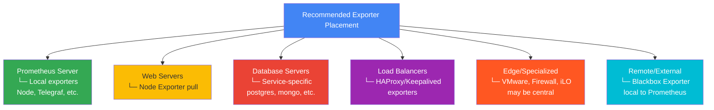

# Exporters Comparison Matrix

Detailed comparison of all exporters included in the full-stack monitoring solution.

## Quick Reference

| Exporter | Component | Metrics | Complexity | Port | CPU | Memory | Status |
|----------|-----------|---------|-----------|------|-----|--------|--------|
| Node Exporter | Linux/Unix | 200+ | ⭐ | 9100 | Low | Low | ✅ Stable |
| Windows Exporter | Windows | 1000+ | ⭐⭐ | 9182 | Low | Medium | ✅ Stable |
| postgres_exporter | PostgreSQL | 100+ | ⭐⭐ | 9187 | Low | Low | ✅ Stable |
| mongodb_exporter | MongoDB | 150+ | ⭐⭐ | 9216 | Low | Low | ✅ Stable |
| clickhouse_exporter | ClickHouse | 80+ | ⭐ | 9363 | Low | Low | ✅ Stable |
| rabbitmq_exporter | RabbitMQ | 200+ | ⭐⭐ | 15692 | Low | Low | ✅ Stable |
| kafka_exporter | Kafka | 100+ | ⭐⭐⭐ | 9308 | Medium | Medium | ✅ Stable |
| jmx_exporter | Java Apps | Custom | ⭐⭐⭐ | 7071 | Low | Medium | ✅ Stable |
| blackbox_exporter | Endpoints | Synthetic | ⭐ | 9115 | Low | Low | ✅ Stable |
| telegraf | Custom | Unlimited | ⭐⭐ | 9280 | Low | Low | ✅ Stable |
| haproxy_exporter | HAProxy | 300+ | ⭐ | 8105 | Low | Low | ✅ Stable |
| keepalived_exporter | Keepalived | 100+ | ⭐ | 9165 | Low | Low | ✅ Stable |
| vmware_exporter | VMware | 500+ | ⭐⭐⭐ | 9272 | Medium | High | ✅ Stable |
| truenas_exporter | TrueNAS | 200+ | ⭐⭐ | 9210 | Low | Low | ✅ Stable |
| fortigate_exporter | Fortigate | 300+ | ⭐⭐⭐ | 9710 | Low | Low | ✅ Stable |
| dns_prober | DNS | Synthetic | ⭐ | Via Blackbox | - | - | ✅ Stable |
| netdata | System | 5000+ | ⭐ | 19999 | High | Medium | ✅ Stable |
| chrony_exporter | NTP | 20+ | ⭐ | 9109 | Low | Low | ✅ Stable |
| hpilo_exporter | iLO/BMC | 200+ | ⭐⭐ | 9416 | Low | Low | ✅ Stable |
| mtr_exporter | MTR | Network | ⭐ | 9570 | Medium | Low | ✅ Stable |
| pushgateway | Batch Jobs | N/A | ⭐ | 9091 | Low | Low | ✅ Stable |

Legend: ⭐ Easy · ⭐⭐ Moderate · ⭐⭐⭐ Complex

---

## Detailed Comparison

### System Monitoring

#### Node Exporter vs Netdata

| Aspect | Node Exporter | Netdata |
|--------|---|---|
| **Coverage** | System metrics (CPU, mem, disk, net) | 5000+ metrics + real-time UI |
| **Performance** | Minimal overhead (~1-2%) | Higher overhead (~5-10%) |
| **Setup** | Simple binary/container | Requires more resources |
| **Features** | Metrics only | Metrics + Visualization |
| **Use Case** | Production servers | Monitoring + exploration |
| **Learning Curve** | Flat | Steeper |

**Recommendation**: Use Node Exporter for production, Netdata for troubleshooting.

---

### Database Monitoring

#### PostgreSQL vs MongoDB vs ClickHouse

| Feature | PostgreSQL | MongoDB | ClickHouse |
|---------|-----------|---------|-----------|
| **Query Metrics** | Yes (via pg_stat_statements) | Yes (via serverStatus) | Yes |
| **Replication** | Full support (WAL/streaming) | Replica sets | No native replication |
| **Connection Pooling** | Metrics available | Metrics available | Metrics available |
| **Slow Query Logs** | Support (custom query) | Support | Limited |
| **Cluster Support** | Yes (standby) | Yes (replica sets) | Limited |
| **Exporter Version** | Mature | Mature | Newer |

**Recommendation**: PostgreSQL & MongoDB are enterprise-ready, ClickHouse for analytics use.

---

### Message Queue Monitoring

#### RabbitMQ vs Kafka

| Aspect | RabbitMQ | Kafka |
|--------|----------|-------|
| **Queue Depth** | Direct metric | Via consumer lag |
| **Consumer Lag** | Per consumer | Per group |
| **Throughput** | Messages/sec | Messages/sec + bytes |
| **Clustering** | Yes | Yes |
| **Metrics Variety** | 200+ standard | 100+ baseline |
| **Setup Complexity** | Simple | Complex |
| **Performance Impact** | Low | Medium |

**Recommendation**: RabbitMQ for simpler setup, Kafka for distributed systems.

---

### Endpoint Monitoring

#### Blackbox Exporter (Only Option)

| Protocol | Support | Features |
|----------|---------|----------|
| **HTTP/HTTPS** | Full | Status, latency, redirect chains, SSL/TLS |
| **DNS** | Full | Query time, record checks |
| **TCP** | Full | Connection time, TLS details |
| **ICMP** | Full | RTT, packet loss |

**Modules Included**:
- `http_2xx` - Standard HTTP checks
- `https_2xx` - HTTPS with cert validation
- `tcp_connect` - TCP port checks
- `icmp` - Ping/latency
- `dns_query` - DNS lookups

---

### Infrastructure Services Monitoring

#### HAProxy vs Keepalived

| Feature | HAProxy | Keepalived |
|---------|---------|-----------|
| **Primary Role** | Load Balancer | HA clustering |
| **Metrics** | Backend status, traffic | State transitions |
| **Integration** | Native exporter | Community exporter |
| **Alerting** | Backend down, latency | State changes |
| **HA Support** | Yes | Primary feature |

**Recommendation**: Monitor both for complete HA insight.

---

### Specialized Infrastructure

#### VMware vs Windows vs SNMP

| Aspect | VMware | Windows | SNMP |
|--------|--------|---------|------|
| **Coverage** | VM/Host/Cluster | Windows-specific | Any SNMP device |
| **Metrics** | 500+ native | 1000+ WMI | Configurable OIDs |
| **Setup** | vSphere API credentials | WMI remote access | SNMP community string |
| **Performance** | Medium overhead | Low overhead | Low overhead |
| **Use Case** | Virtualization | Windows servers | Network equipment |

**Recommendation**: Use VMware for virtual environments, specific exporters for specialized hardware.

---

### Application Instrumentation

#### JMX vs Process Exporter vs Telegraf

| Aspect | JMX | Process Exporter | Telegraf |
|--------|-----|------------------|----------|
| **Application Types** | Java only | Any process | Any/Custom |
| **Metrics** | JVM-specific | Process stats | Unlimited custom |
| **Configuration** | YAML rules | Instance selection | Plugin-based |
| **Flexibility** | Low | Medium | Very High |
| **Learning Curve** | Moderate | Flat | Steep |

**Recommendation**: JMX for Java, Telegraf for flexibility and custom metrics.

---

## Setup Complexity Breakdown

### Simple (⭐) - 5-10 minutes
- Node Exporter
- Blackbox Exporter
- Telegraf (basic)
- PostgreSQL Exporter
- MongoDB Exporter

### Moderate (⭐⭐) - 15-30 minutes
- HAProxy Exporter
- Keepalived Exporter
- RabbitMQ Exporter
- Chrony Exporter
- iLO Exporter
- TrueNAS Exporter

### Complex (⭐⭐⭐) - 30+ minutes
- Kafka Exporter (broker topology)
- JMX Exporter (rule configuration)
- VMware Exporter (API integration)
- Fortigate Exporter (API authentication)

---

## Resource Usage Guide

### CPU Impact (At Scale)

```
Low (<1%):    Node, Blackbox, postgres_exporter, mongodb_exporter
Medium (1-5%): RabbitMQ, telegraf, HAProxy, Keepalived
High (5%+):   Kafka, VMware, Netdata
```

### Memory Usage (Baseline)

```
<10MB:   Node, Blackbox, Telegraf
10-50MB: Exporter containers, HAProxy, Keepalived
50MB+:   VMware, Netdata, Kafka exporters
```

## Deployment Patterns

### Recommended Instance Placement



## Migration Guide

### From Alternative Monitoring (e.g., Zabbix/Nagios)

| Aspect | Migration Strategy |
|--------|-------------------|
| **Historic Data** | Use remote storage for backfill |
| **Alert Rules** | Rewrite using PromQL |
| **Dashboards** | Rebuild in Grafana |
| **Training** | Start with Node+Blackbox, expand |
| **Cutover** | Parallel run, gradual migration |

## Troubleshooting by Exporter

See [TROUBLESHOOTING.md](../docs/TROUBLESHOOTING.md) for detailed guides.

## Performance Tuning

### High Cardinality Metrics

```
At-Risk Exporters:
- VMware (many VMs)
- Kafka (many topics)
- MongoDB (many collections)

Mitigation:
- Use metric_relabel_configs to drop
- Increase scrape interval
- Use recording rules for aggregation
```

### Scale Limits

```
Recommended Limits per Prometheus:
- 100-500 targets (depending on cardinality)
- 1-10k unique metrics
- ~1GB storage per million metrics/day
```

## Exporter Update Policy

- **Stable**: Bug fixes, security patches
- **LTS**: Long-term support planned
- **Maintenance**: Community-maintained
- **Experimental**: Use with caution

Check GitHub releases for update notes.

---

**Need more details?** Check individual exporter documentation in `exporters/` directory.
